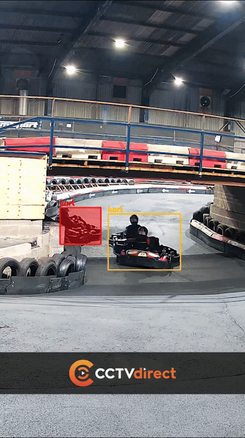

# ai-kart-tracking

## Backstory 

During my time at TeamSport as a marshall, we would have a monitor wil various CCTV feeds we could view to watch the karts and look out for a crash we could then go over and get the customer out of the crash. 

I had noticed there were some parts on the track which were very hard to see on CCTV, and if a kart had crashed or stopped in that spot, it could be a risk to to themselves and other customers. 

I wanted to see if I could assist the marshals who were scanning the screens all the time for something that may not even happen. Instead of them monitoring the screen at all times my idea would draw attention to the crash the moment the kart stops moving.

## What it does
The system takes a video feed of a karting track and, frame by frame:
 
- Detects every kart in view with a YOLO object detector
- Tracks each kart across frames so it has a stable identity, not just a per-frame box
- Classifies each kart's motion state and colour-codes the bounding box - **green** (driving), **amber** (slow), **red** (stopped)
- Renders stopped karts as a flashing translucent overlay so a marshal, or an automated alert, can react to a kart that has stopped where it shouldn't

## How I built it

I built the whole thing on my home PC, training on an **RTX 4060 Ti** (I originally had the idea to have it run on an **NVIDIA Super Orin Nano**, which would be physically small to fit in a TeamSport location, yet powerful enough, to detect 4 to 6 CCTV feeds at once). I had to use **Python 3.12.3** specifically, because the newer version I tried didn't have CUDA available yet, and I installed the **GPU build of PyTorch** (via the `cu128` index) so training actually ran on the graphics card.

Collecting and labelling the data. I pulled frames from a different track CCTV footage which was publicly accessible on YouTube, and labelled every kart by hand in Roboflow, using a single class, kart. That gave me a dataset of a few hundred labelled frames exported in YOLO11 format. I held back a few whole clips from training data so I'd have unseen real-world footage to test against later.

I wrote a KartState class that, for each tracked kart, measures how far it's actually moved over a short rolling window (about 0.4 seconds), normalised by the size of its bounding box so it works the same whether a kart is near or far from the camera. I then band that movement into three states against distance thresholds; green for driving, amber for slow, red for stopped.

For stopped karts I draw a flashing translucent fill over the kart on a copy of the frame.

## Dataset
 
- Frames pulled from track CCTV footage, labelled in Roboflow, single class `kart`.
- A handful of full clips were **held back entirely** - never uploaded, never trained on -
-  kept as unseen real-world test footage. That held-back set is what caught the model-selection issue above.

## What is YOLO and Roboflow
- **Roboflow** - a web tool for labelling images (drawing the boxes around each kart by hand) and exporting them in the format a model expects.
-  **YOLO ("You Only Look Once")** - a family of fast object-detection models designed to run in real time

## Confidence level

The detection confidence threshold controls how sure the model has to be before it keeps a detection and draws a box. The scale is between 0 amd 1.

I tested the clips with two confidence levels, 0.3 and 0.45.

The biggest difference showed up on the karts far away on the track, the small hard to see ones.

**At 0.45:**

**At 0.3:**

At 0.3, all the distant karts were picked up, and all were picked up as green, which means moving at full speed, while at 0.45 they were only picked up with a yellow box which means they are on the edge of coming to a stop.

Full video:

